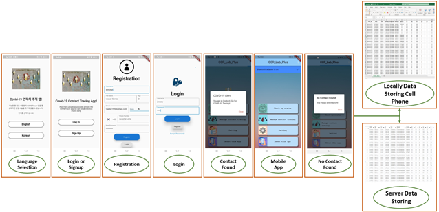

# Code Running

For the running of code use following command: Flutter run lib\widgets.dart

# Current Work

Login, Signup is intergrated with sensor data, Beacons Data (BT) and Basic GUI. You need two mobile phones to test the working of contact tracing.

## Mobile Application Overview

Smartphone is remarkable to users in everyday life, It also contains built-in sensors that proficiently sense relevant information related to its users while being supported with an extensive range-ability of network contacts. For the contact tracing, developed the mobile app that collect the user information, user contact traces, user location, and some other sensors information including accelerometer, gyroscope, speed sensor. Bluetooth and GPS based contact tracing is done with the help of GPS and Bluetooth data.
Mobile app contains, language selection, user registration, user login, email verification, and main screen. Functionalities including, sensors data collection, beacon transmission, beacon receiving, data storing locally in a mobile device, and data upload on the server is done automatically. The figure 1 shows the overview of the mobile app GUI.
